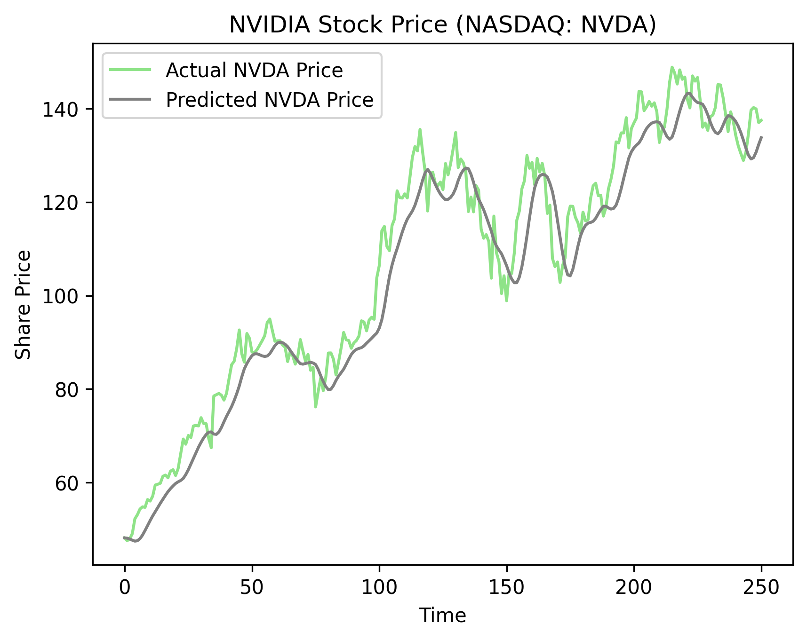

# Stock Price Prediction using LSTM

## Overview
This project predicts stock prices for **NVIDIA (NVDA)** and **AMD** using a **Long Short-Term Memory (LSTM)** neural network. The model is trained on historical stock data fetched from Yahoo Finance and visualizes the predictions using Matplotlib.

## Dataset
The dataset is obtained using the `yfinance` Python library, covering the period from **January 1, 2014, to December 31, 2023**.

- **Stocks analyzed**: NVIDIA (NVDA) and AMD.
- **Feature used**: Closing price.
- **Data Preprocessing**: Prices are scaled using `MinMaxScaler` from Scikit-Learn.

## Model Architecture
The LSTM model consists of:
- 3 LSTM layers with **50 units each**
- **Dropout layers (20%)** to prevent overfitting
- **Dense output layer** to predict the stock price
- **Loss function**: Mean Squared Error (MSE)
- **Optimizer**: Adam
- Trained for **25 epochs** with a batch size of 32

## Results
The model predicts stock prices based on the last **90 days** of historical data. The results are visualized in the following plots:

### NVIDIA Stock Price Prediction


### AMD Stock Price Prediction


### 1-Day Prediction by Model
- **NVIDIA (NVDA)**: $ 129.92
- **AMD**: $ 121.98

### Realtime Stock Price (Jan 23rd, 2025 - 23:45)
- **NVIDIA (NVDA)**: $ 134.40
- **AMD**: $ 110.84

## How to Run the Project
1. Install required dependencies:
   ```bash
   pip install pandas numpy matplotlib seaborn yfinance tensorflow scikit-learn
   ```
2. Run the Jupyter Notebook:
   ```bash
   jupyter notebook stocks.ipynb
   ```

## Author
Developed by **Arush**, as part of a Stock Market Prediction exploration using Deep Learning.

